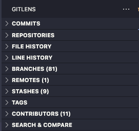
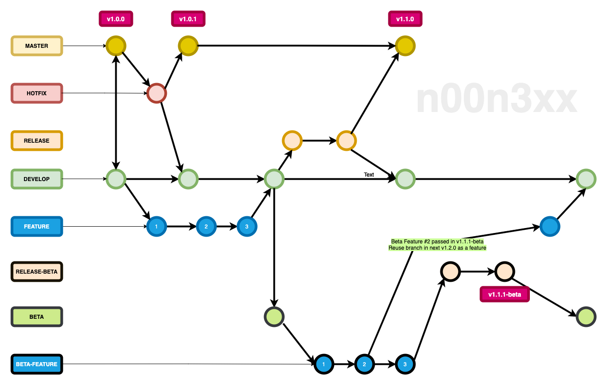

# Git - Practices, How-Tos, & Strategies
> written around October '21
>
> NOTE: git practices, habits and strategies will always depend on the team's preferences, project etc. etc.

# Common Branches

<aside>
💡 see links in Flow section below
</aside>

- Main (Master) - based off of last released develop
- Hotfix - based off of Master, for doing hotfix branches/commits after a release reported bugs
- Develop - based off of main/release — for development of feature/chore/fix/etc branches
- Release - based off of develop — do git tagging (release) here, staging/production fix branch commits if any, build & test, and lastly, merge back to master & develop
- Beta - based off of develop — for developing pretotypes and other features (feature/chore/fix/etc branches also applies here)
- Release-Beta - based off of beta — do git tagging (beta) here, staging/production fix branch commits if any, build & test (will not be merged in any other branches)

# Branch Name Prefixes

> these are just examples and any team are free to create their own
> 
- feat/* or feature/*
- betaFeat/* or betaFeature/*
- chore/*
- fix/* or bug/*
- hotfix/*
- refactor/*
- upgrade/*

<aside>
💡 note: as best practice, branch name has to be concise like the ff examples:

</aside>

- `feat/todo-screen`
- `chore/set-up-yaml`
- `hotfix/login-submit-btn-press`
- `fix/todo-textinput-limit`
- `betaFeat/collapsible-todo-list`
- `upgrade/react-native-version`
- `refactor/todo-parent-child-components`

<aside>
💡 bad practices of branch naming: `todo`, `ticket#231`, `rn-upgrade`, `setupConfigs`, `tpc183`, `todo-parent-child-components`
</aside>

# Gitlens: a VSCode Extension

These are all the features of Gitlens. On a daily basis, I personally use commits, repositories, file history, line history, stashes and on special cases, search & compare (for searching commits or comparing 2 branches)

![As seen on the image, within Branches feature of Gitlens, there's release, develop and master branches and all the branch prefixes like feature, chore and fix automatically compiled in their own folders because of the syntax "[prefix]/*" after git pushing. Other branches are examples of bad branch naming practices.](assets/Gitbranches.png)

As seen on the image, within Branches feature of Gitlens, there's release, develop and master branches and all the branch prefixes like feature, chore and fix automatically compiled in their own folders because of the syntax "[prefix]/*" after git pushing. Other branches are examples of bad branch naming practices.

# Branching Strategy

As an example, on a fresh repository, the team will develop and build the MVP from v0.0.1 to v1.0.0 then have those merged into Master and Develop. After any release, it is possible that a few bugs might appear and that's what Hotfix branches do, coming from Master and merging to Master and Develop.

On a normal sprint, here we can see 3 new features based off of develop or any other feature branch (all feature branches will be merged back to Develop and removed/deleted). By the end of the sprint:
- team creates a staging build & test
- if passing, we pull develop in release branch otherwise do fix/* branches to develop
- build & test production in release branch
- possibly, adding a few fixes in release branch
- if production is passing, in cli, do: `git tag v1.1.0` then release!!!
- lastly, we create a merge/pull request to Master and Develop.

If the team starts or is required to do beta releases (see Feature Flag links below), base Beta branch off of Develop and as an example (3 beta features), branch out from Beta Branch to any betaFeat/* branches. Same cycle of develop releases but with the ff:
- probably shorter in time, ie, a beta release might be 1/2 or 1/3 in time of a develop release
- betaFeature/* branches are merged back to Beta Branch but not removed/deleted or in other terms, `long running branches`
- same staging/production "build & test" in Beta/Release-Beta Branch respectively
- possibly with fix/* branches/commits
- once passed in production build (Release-Beta Branch), release!!! then do tagging: `git tag v1.1.1-beta`. RB Branch doesn't need to be merged to any branches
- at some point, the team will get the beta users' feedback. as an example, beta feature # 2 passed based on some criteria and betaFeature/* branch # 2 was reused in a feature/* branch that will be merged to Develop for another release version v1.2.0.
- all betaFeature/* branches can now be removed/deleted
- take note that it is also possible to tag betaFeature/* branches ie. `git tag vX.Y.Z-beta-[betaFeature/name-here]`
- should you choose using 1 release branch for develop and beta, read more on [git rebase standard](https://www.atlassian.com/git/tutorials/rewriting-history/git-rebase) and git rebase interactive

# [Git Tagging](https://git-scm.com/docs/git-tag)

In release branch: `git tag vX.Y.Z`

In beta-release branch: `git tag vX.Y.Z-beta OR using  git tag vX.Y.Z-beta.a.b.c`

<aside>
💡

- add change logs and/or assets for documentation purposes

- if necessary, it is also possible to tag `betaFeature/* branches` ie. `git tag vX.Y.Z-beta-[betaFeature/name-here]`
- by practicing `git tag` on any release (develop/beta/betaFeature), it's easier to keep track of the changes of different versions and any dev can branch out to any tag
- look for some open-source repository releases/tags as an example and see how they do it
</aside>

# Commits

<aside>
💡 see links Commit Section below
</aside>

- commit as much as possible
- commit small & atomic: 1 change, 1 commit otherwise separate into several commits
- commit short and unambiguous:  describes the behavior of the code change not what code has changed
- commit: active voice - use the imperative verb, present tense, ie. Add > Added

# Merge/Pull Request

<aside>
💡 see Template links in Docs Section below

</aside>

- MR/PR Title has to be concise (optional: add "-B123" based on sprint B ticket # 123)
- Team can create a template for MR/PR but usually is consisting of the ff:
    - Description
    - Solution Choices and why or Relevant Links(issues tab of repo, github links, stackoverflow links, or library docs link)
    - Platform OS it is for
    - Docs/Steps of set up and/or how to test
    - screenshots/clips/gif
    
    <aside>
    💡 note: after uploading images/gifs in MR/PR, you can use html img tag plus the generated image source, then adjust width/height props
    </aside>
    
    - other relevant notes
- for betaFeature/* branches, follow the list above but always update the README with relevant screenshot assets.

<aside>
💡 note: screenshot assets of the changes in betaFeature/* branches can be added in an assets/ folder outside the build
</aside>

- as much as possible, there are 2 or more reviewers required. It's possible that 1 reviewer might miss a few things that the other one might notice. 2 reviewers give different insights/approach. *(ask, learn, suggest on MR/PRs). If in case, 1 of main 2 reviewers is on leave, any dev can review it*
- use Issues Tab on gitlab/github to keep track of the ff:
    - temporary code changes
    - current issues (investigations done/related article links and such)
    - label/tagging (whether it is a doc type regarding a change from a PR, issues/bugs type, etc)
    - jira tickets are for project management only but for dev notes, put everything here or use something like Notion
    - templates like in MR/PRs are optional
    - check open source projects / any library for samples
- once there are at least 2 or x number of approval and change requests are done and tested, owner of the MR/PR / maintainer of repo should merge it

# Working on a X number of features with multiple devs on a Y week/s sprint

On a longer sprint like 3 weeks to a month, and enough resources, some teams assign a chunk of ticket with a single feature to a dev. A caveat would be having too many unknowns for the reviewer even having an idea of the ticket itself and MR/PRs are way to huge, 5k-10k lines of code in one go. 🤯

However, on a team with fewer resources and has a shorter sprint like 1-2weeks, there are also fewer features to work on, thus, the team distribute a single chunk of ticket/feature into smaller tasks, to multiple devs, sometimes, to just a single one. This encourages/boosts team coordination, not just how to handle the code itself or handling git branches but also communication.

For best practices working on any huge feature on any sprint, slice a feature into working parts. Each part has their own `subFeature/*` branch that'll be merged back to `feature/*` branch which then will go to `develop`. By doing so, team avoids having the reviewers read thousands and thousands of code lines but read/absorb each section/part of the feature, probably would have a better idea of the whole, and keeping the codebase on a healthy state.

<aside>
💡 Number of subFeature/* branches IS EQUAL TO Number of slices/parts of a feature IS EQUAL TO Number of MR/PRs of huge feature
</aside>

# Others:

- [Creating a personal access token](https://docs.github.com/en/authentication/keeping-your-account-and-data-secure/creating-a-personal-access-token) (for 2fa enabled & private repo in GH)

### Git Commands

- [Git Docs](https://git-scm.com/doc)
- [Github - Git Cheat Sheet](https://training.github.com/downloads/github-git-cheat-sheet.pdf)
- [Git Commands](https://wethefoss.github.io/Git-Commands/?ref=producthunt)

### Git Tutorials on Youtube

- [Git Tutorial for Beginners: Command-Line Fundamentals](https://www.youtube.com/watch?v=HVsySz-h9r4)
- [FreeCodeCamp - Git and GitHub for Beginners - Crash Course](https://www.youtube.com/watch?v=RGOj5yH7evk)
- [Git Tutorial for Beginners: Learn Git in 1 Hour](https://www.youtube.com/watch?v=8JJ101D3knE)

### Git Commits

- [Git/GitHub commit standards & conventions](https://gist.github.com/digitaljhelms/3761873)
- [Writing Meaningful Commit Messages](https://reflectoring.io/meaningful-commit-messages/)
- [How to Write Good Commit Messages: A Practical Git Guide](https://www.freecodecamp.org/news/writing-good-commit-messages-a-practical-guide/)

### Docs

- [Github Docs](https://docs.github.com/en)
- [Gitlab Docs](https://docs.gitlab.com/)
- GH - [Configure Default Reviewers - Code Owners](https://docs.github.com/en/repositories/managing-your-repositorys-settings-and-features/customizing-your-repository/about-code-owners#about-code-owners)
- GH - [Creating a pull request template for your repository](https://docs.github.com/en/communities/using-templates-to-encourage-useful-issues-and-pull-requests/creating-a-pull-request-template-for-your-repository)
- GL - [Description Templates](https://docs.gitlab.com/ee/user/project/description_templates.html)
- GH - [github1s: Read a github repository in a web based vscode](https://github.com/conwnet/github1s)

### Feature Flags

- [Feature Flags - Atlassian](https://www.atlassian.com/continuous-delivery/principles/feature-flags)
- [5 tips for getting started with feature flags - Atlassian](https://www.atlassian.com/blog/jira-software/tips-for-feature-flagging)
- [Split - Feature Flags](https://www.split.io/product/feature-flags/)
- [FeatureFlags.io](https://featureflags.io/)
- [Gitlab - Feature Flags](https://docs.gitlab.com/ee/operations/feature_flags.html)
- [Github Blog - How we ship code faster and safer with feature flags](https://github.blog/2021-04-27-ship-code-faster-safer-feature-flags/)
- [Top 10 Feature Flags Projects on GitHub](https://www.flagship.io/github-feature-flags/)

### Semantic

- Semantic Release - [Introduction](https://semantic-release.gitbook.io/semantic-release/)
- Semantic Release - [Publishing on distribution channels](https://github.com/semantic-release/semantic-release/blob/1405b94296059c0c6878fb8b626e2c5da9317632/docs/recipes/distribution-channels.md)
- [Semantic Versioning 2.0](https://semver.org/)
- Changelog (for Changelog.md) format based on [keepchangelog](https://keepachangelog.com/en/1.0.0/)

### Flow

- [A successful Git branching model](https://nvie.com/posts/a-successful-git-branching-model/) (the basis for this flow model)
- [Git Flow Cheat Sheet](https://danielkummer.github.io/git-flow-cheatsheet/)
- [GitFlow Introduction](https://datasift.github.io/gitflow/IntroducingGitFlow.html)

### [React / RN: Configuration Driven Development (CDD)](https://medium.com/captech-corner/an-intro-to-configuration-driven-development-cdd-48a1c088baa9)
